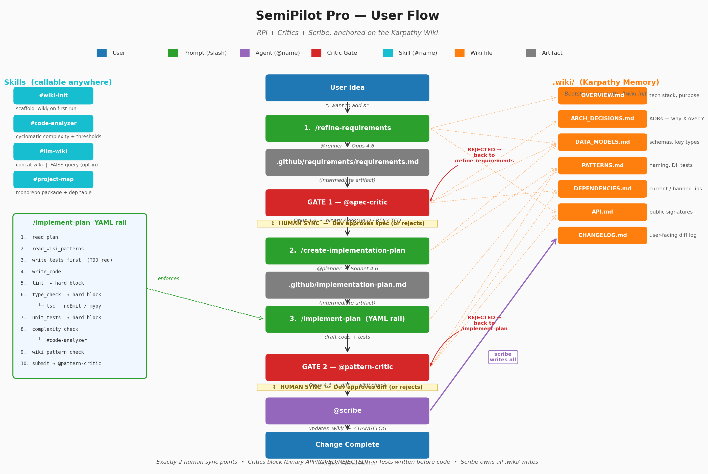

# SemiPilot Pro

An agentic software development system for GitHub Copilot in VS Code and Claude Code. It takes a raw idea through requirements, planning, implementation, and documentation — enforcing quality at two gated checkpoints, surfacing the change's blast radius before code is written, and keeping the wiki as the team's shared memory.

---

## How it works



Every change follows the same top-to-bottom pipeline. Two human decisions per successful cycle: **approve the spec** (after Gate 1) and **approve the diff** (after Gate 2). Everything else runs automatically.

**What's new in the current build:**

- **Impact analysis up front.** `@refiner` traces consumers, side-effect surfaces, and tests for every symbol the change touches — before drafting acceptance criteria. Catches the kind of side effect that gets missed on a refactor.
- **Automatic decomposition.** If a change crosses >5 files, >2 architectural boundaries, introduces a new pattern, or modifies a shared API with >3 call sites, `@refiner` emits a `requirements-index.md` + sub-files. `/run-pipeline` walks each sub-cycle through its own RPI pass.
- **Declared overrides.** `.github/pipeline-overrides.yaml` replaces commenting-out critic checks. Bypasses are recorded in `rejection-log.md`, never hidden.
- **Partial entry points.** `/run-pipeline` can start at any step (`refine` / `spec-critic` / `plan` / `implement` / `pattern-critic` / `scribe`) via the override file's `entry_point.start_at`.
- **Real agent handoffs.** Each agent ends with a `### HANDOFF:` block; `/run-pipeline` invokes the next subagent via the `Agent` tool — no manual copy-paste between steps.

---

## Structure

```
semiPilotPro/
├── semipilot-core.md           # Full system contract — pipeline, YAML rail, golden rules
├── copilot-instructions.md     # Copilot workspace entry point (mirrors core)
├── agents/
│   ├── refiner.agent.md        # Turns raw ideas into testable requirements
│   ├── planner.agent.md        # Writes concrete implementation plans
│   ├── spec-critic.agent.md    # Gate 1 — pre-implementation feasibility check
│   ├── pattern-critic.agent.md # Gate 2 — post-implementation standards check
│   ├── implementer.agent.md    # YAML rail executor (isolated subagent)
│   └── scribe.agent.md         # Updates .wiki/ and CHANGELOG
├── prompts/
│   ├── run-pipeline.prompt.md          # Chains all steps; pauses at gates
│   ├── refine-requirements.prompt.md   # Writes requirements.md
│   ├── create-implementation-plan.prompt.md
│   ├── implement-plan.prompt.md        # Executes the 11-step YAML rail
│   ├── fix-rejection.prompt.md         # Applies Gate 2 fixes and resubmits
│   ├── create-mr-description.prompt.md # Generates structured PR description
│   └── explain-changes.prompt.md       # Answers "why was X changed?" with source citations
├── skills/
│   ├── wiki-init/      # Scaffolds .wiki/ on first use
│   ├── patterns-seed/  # Infers naming/DI/error/test conventions from an existing codebase → seeds PATTERNS.md
│   ├── llm-wiki/       # Builds a context document from wiki + source for LLM queries
│   ├── code-analyzer/  # Cyclomatic complexity + file-level deltas, JSON output
│   └── project-map/    # Monorepo package + dependency map
└── wiki-templates/     # Starter templates for the 7 wiki files
```

---

## Getting started

**1. Install**

Copy this folder into your project's `.github/` directory (or point your Copilot workspace at it):

```
your-project/
└── .github/
    ├── copilot-instructions.md
    ├── agents/
    ├── prompts/
    └── skills/
```

**2. Bootstrap the wiki**

```
#wiki-init
```

This scaffolds `.wiki/` with seven template files. `OVERVIEW.md` and `DATA_MODELS.md` are auto-seeded from detected manifests and schemas.

**3. Seed PATTERNS.md from your existing code**

```
#patterns-seed
```

Required on a non-empty codebase. Infers your naming convention, DI style, error-handling style, and test-file pattern from the code as it is today, and writes them to `PATTERNS.md`. Without this, the Pattern Critic has nothing to enforce on cycle 1 and rejects every diff — which is the usual reason people end up commenting out critic checks.

Run with `--dry-run` first to inspect what it inferred; edit `PATTERNS.md` by hand if a section is wrong. This is the only wiki file you may edit directly during bootstrap; `@scribe` owns it afterwards.

**4. Fill in the rest of the wiki**

Before running any cycle, also fill in:

- `.wiki/DEPENDENCIES.md` — current, deprecated, and banned libraries
- `.wiki/DATA_MODELS.md` — key schemas (auto-seeded; verify)

Budget 30 minutes. The critics will fail loudly if these are empty.

**5. Run your first cycle**

```
/run-pipeline
```

Or manually, step by step:

```
/refine-requirements → @spec-critic → /create-implementation-plan → /implement-plan
  → @pattern-critic  (REJECTED? → /fix-rejection → @pattern-critic)
  → /create-mr-description → @scribe
```

To start in the middle of the pipeline, write `.github/pipeline-overrides.yaml` with `entry_point.start_at: <step>` and any required `inline_inputs`. See `semipilot-core.md > Partial Entry Points`.

---

## The YAML rail

`/implement-plan` follows 11 enforced steps in order. Hard-block means the implementer stops and posts the verbatim error — it does not skip ahead.

| Step | Hard block? |
|---|---|
| 1. read_plan | yes |
| 2. read_wiki_patterns | yes |
| 3. write_tests_first | yes |
| 4. write_code | yes |
| 5. lint | yes |
| 6. type_check | yes |
| 7. unit_tests | yes |
| 8. explain_test_changes | yes |
| 9. complexity_check | no (flags for Gate 2) |
| 10. wiki_pattern_check | yes |
| 11. submit_for_pattern_critic | yes |

Step 8 (`explain_test_changes`) requires a documented reason for every pre-existing test that was modified. The pattern critic verifies these reasons before approving.

---

## The wiki (`.wiki/`)

Seven files. Scribe is the only agent that writes to them.

| File | Purpose |
|---|---|
| `OVERVIEW.md` | Tech stack, project purpose, team conventions |
| `ARCH_DECISIONS.md` | Architecture Decision Records |
| `DATA_MODELS.md` | Schemas, key types, relationships |
| `PATTERNS.md` | Naming, DI, error-handling, and test standards |
| `DEPENDENCIES.md` | Current / deprecated / banned libraries |
| `API.md` | Public API signatures and contracts |
| `CHANGELOG.md` | User-facing: what changed and why |

---

## Agents

| Agent | Role | Model |
|---|---|---|
| `@refiner` | Requirements analysis and gap detection | Claude Sonnet 4.6 |
| `@planner` | Technical implementation plan | Claude Sonnet 4.6 |
| `@spec-critic` | Gate 1 — pre-implementation feasibility | Claude Opus 4.6 |
| `@pattern-critic` | Gate 2 — post-implementation standards | Claude Opus 4.6 |
| `@implementer` | YAML rail executor — runs in isolated context window | Claude Sonnet 4.6 |
| `@scribe` | Wiki and changelog updates | Claude Sonnet 4.6 |

Critics run on Opus — a wrong gate call is the most expensive error in the pipeline. Workers run on Sonnet. `@implementer` runs as a subagent so implementation context (lint logs, test output) stays isolated from the orchestrator.

---

## Prompts

| Prompt | Purpose |
|---|---|
| `/run-pipeline` | Full pipeline in one command; pauses at both gates |
| `/refine-requirements` | Write `requirements.md` from a raw idea |
| `/create-implementation-plan` | Write `implementation-plan.md` from an approved spec |
| `/implement-plan` | Execute the YAML rail: tests first, then code |
| `/fix-rejection` | Apply critic's required fixes and resubmit after a Gate 2 rejection |
| `/create-mr-description` | Generate a structured PR description after Gate 2 |
| `/explain-changes` | Answer "why was X changed?" with citations to plan and diff |

---

## Skills

| Skill | Purpose |
|---|---|
| `#wiki-init` | Scaffold `.wiki/` on first use |
| `#patterns-seed` | Infer naming, DI, error-handling, and test conventions from an existing codebase. Seeds `PATTERNS.md` so the Pattern Critic has something to enforce on cycle 1. |
| `#llm-wiki` | Build a context document for LLM queries (concat or FAISS) |
| `#code-analyzer` | Cyclomatic complexity + file-level deltas, JSON output |
| `#project-map` | Monorepo package and dependency map |

All skills support `--dry-run`.

---

## Further reading

- [`USER_GUIDE.md`](USER_GUIDE.md) — walkthrough of every flow, troubleshooting, composition patterns
- [`semipilot-core.md`](semipilot-core.md) — full system contract and golden rules
